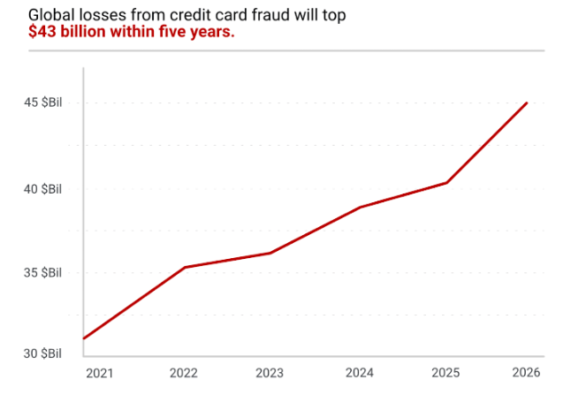
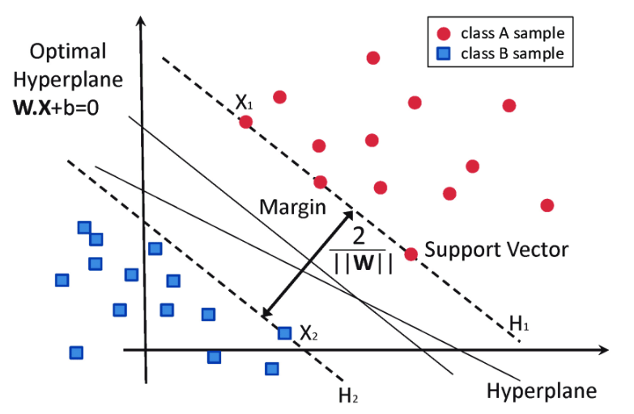
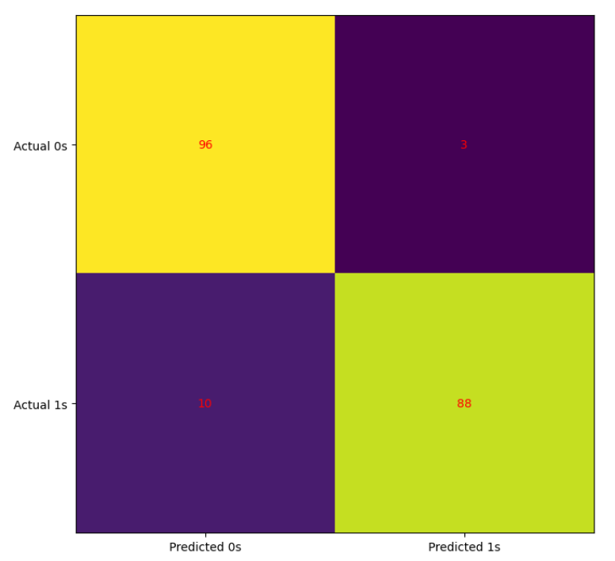
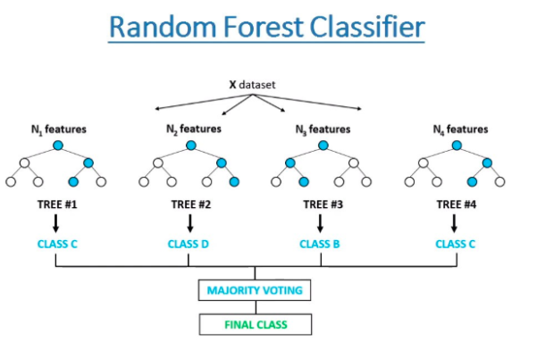
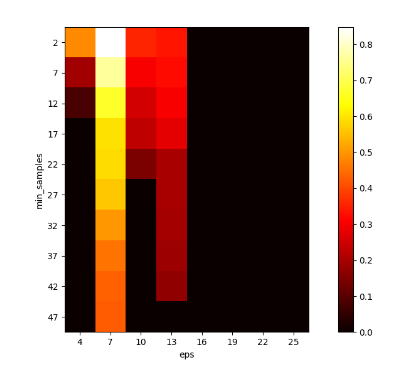
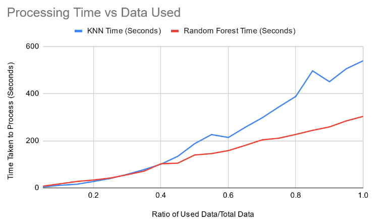

## Introduction and Background

Credit card fraud has become a pressing issue in the digital age, especially with the increase in electronic transactions, which bypass many traditional security measures. In 2023, it was reported that 151 million American adults were victims of credit card fraud, a significant increase from the preceding year. This escalation not only results in substantial financial losses but also erodes trust in electronic payment systems, leading to a negative impact on both consumers and financial institutions. The need for advanced and reliable methods to detect fraudulent transactions in real-time has never been greater. Our research is focused on addressing this need by developing a sophisticated algorithm capable of identifying these fraudulent activities efficiently and effectively. The broader impact of credit card fraud beyond financial losses includes its effect on consumer behavior and trust.

Reference: [https://merchantcostconsulting.com/lower-credit-card-processing-fees/credit-card-fraud-statistics/](https://merchantcostconsulting.com/lower-credit-card-processing-fees/credit-card-fraud-statistics/)

The domain of credit card fraud detection has been an active area of research, where numerous algorithms have been applied and evaluated. Studies as far back as 2018 and 2019 have leveraged classical machine learning techniques such as Decision Trees, Support Vector Machines (SVM), Logistic Regression, Random Forest, Naive Bayes, and Multilayer Perceptrons [3][4]. These algorithms demonstrated varying degrees of success in identifying fraudulent transactions. To further address this challenge, researchers introduced smart resampling techniques like SMOTE (Synthetic Minority Oversampling Technique) and ADASYN (Adaptive Synthetic Sampling) in 2021 [5]. These techniques artificially increased the number of minority class (fraudulent transactions) samples, allowing the machine learning models to better learn from these rare but important cases. In 2022, research expanded to include generic algorithms (GA) combined with multiple machine learning models to improve detection rates and understand the correct methods of tuning hyperparameters [1]. GAs, inspired by the principles of natural selection, were employed to optimize the feature selection process, identifying the most relevant factors that contribute to fraudulent transactions. It was also identified in many studies that unsupervised learning algorithms provide an interesting methodology to move forward with this problem for anomaly detection and observing varying types of transactions [6]. These approaches improved the detection rates and provided insights into the underlying patterns of fraudulent behavior. Despite these efforts, there remains a critical challenge in minimizing false positives while achieving high accuracy in real-time fraud detection.

## References for Background

1. Ileberi, Emmanuel & Sun, Yanxia & Wang, Zenghui. (2022). A machine learning based credit card fraud detection using the GA algorithm for feature selection. Journal of Big Data. 9. 10.1186/s40537-022-00573-8.
2. Pozzolo, A.D., & Bontempi, G. (2015). Adaptive Machine Learning for Credit Card Fraud Detection.
3. Khare, N., & Sait, S. Y. (2018). Credit card fraud detection using machine learning models and collating machine learning models. International Journal of Pure and Applied Mathematics, 118(20), 825-838.
4. Varmedja, Dejan & Karanovic, Mirjana & Sladojevic, Srdjan & Arsenovic, Marko & Anderla, Andras. (2019). Credit Card Fraud Detection - Machine Learning methods. 1-5. 10.1109/INFOTEH.2019.8717766.
5. T. K. Dang, T. C. Tran, L. M. Tuan, and M. V. Tiep. (2021). Machine learning based on resampling approaches and Deep Reinforcement Learning for credit card fraud detection systems. Applied Sciences, vol. 11, no. 21, p. 10004,  doi:10.3390/app112110004
6. H. Bodepudi. (2021). Credit card fraud detection using unsupervised machine learning algorithms. International Journal of Computer Trends and Technology, vol. 69, no. 8, doi: 10.14445/22312803/ijctt-v69i8p101

## Data Description

Dataset Link: [https://www.kaggle.com/datasets/mlg-ulb/creditcardfraud](https://www.kaggle.com/datasets/mlg-ulb/creditcardfraud)

The dataset for our study is derived from credit card transactions in September 2013 from European cardholders, featuring 284,807 transactions over two days, including 492 frauds. The data is significantly unbalanced, with frauds constituting only 0.172% of all transactions, highlighting the difficulty of identifying these events among legitimate activities. The features within this dataset are primarily numerical and are the result of a PCA transformation, aimed at preserving user confidentiality. With the exception of 'Time' and 'Amount', all other features (V1 through V28) are principal components (already undergone a dimensionality reduction method). Many new datasets include certain features such as ‘Gender’, ‘Age’, ‘Name’, etc. that are not as valuable to identify fraud as features in our selected dataset as they are seen as noise, which do not help in optimizing the model. We chose this dataset after a lot of research as it was the most detailed, comprehensive, and renowned one in spite of it being imbalanced to some extent. The 'Time' feature indicates the seconds elapsed since the first transaction, and 'Amount' represents the transaction value, which can be crucial for cost-sensitive learning models. The target variable, 'Class', is binary, indicating fraud (1) or non-fraud (0). Fraud methods and patterns evolve over time, due to many changes. It is important to note them and continuously train the model to adapt to these changes.

## Problem Definition

The problem at hand is the ever-growing and increasingly sophisticated menace of credit card fraud, which has reached alarming proportions, far surpassing the capabilities of traditional detection methods currently in place. Fraudsters are continuously adapting to the security measures, making it an ongoing challenge for the financial sector to develop and deploy more advanced, real-time detection capabilities. Using simple manual methods is not enough and there is a need to introduce more automated processes. To address this growing concern, the project's problem definition encompasses a multifaceted approach leveraging state-of-the-art machine learning models and techniques to secure customers and financial institutions.

**Approach to solving this issue:**

The primary objective is to develop a robust and adaptive fraud detection system that can keep pace with the evolving strategies employed by fraudsters. This entails the utilization of a variety of supervised learning algorithms such as K-Nearest Neighbors (KNN), Random Forest classifier, Support Vector Machines (SVM), Logistic Regression, and even deep learning techniques like Neural Networks. By employing these models, the project aims to improve the accuracy and efficiency of fraud detection by analyzing historical transaction data and identifying suspicious patterns in real-time.

The project also acknowledges the challenge posed by imbalanced datasets, where the majority of transactions are legitimate, and only a small fraction represents fraudulent activity. To address this issue, it incorporates various data preprocessing and resampling methods, including undersampling, Synthetic Minority Over-sampling Technique (SMOTE), and potentially the Adaptive Synthetic Sampling (ADASYN) technique. These methods are vital in creating a more balanced dataset, ensuring that the machine learning models can effectively learn and detect fraudulent transactions without being overwhelmed by the sheer volume of legitimate ones.

Moreover, the project aims  to explore unsupervised learning algorithms such as K-Means, DBScan, and Hierarchical clustering to conduct clustering analysis. Although the problem is a classification, which is why using supervised learning is implied, these unsupervised techniques can help in uncovering hidden patterns within the data, potentially identifying groups of transactions with similar characteristics, which might be indicative of differing fraudulent behavior.

## Project Motivation

The rationale for tackling this issue is multifaceted, with a primary focus on safeguarding consumers and upholding the integrity of the financial system. Fraudulent transactions inflict direct financial losses on both cardholders and financial institutions, while also giving rise to longer-term consequences, including increased security costs, elevated transaction fees, and a gradual erosion of trust in electronic payment methods among customers. These repercussions underscore the imperative need for enhancing fraud detection systems.

The core technical impetus behind this project is to mitigate the impact of credit card fraud by developing a sophisticated machine learning algorithm capable of swiftly and accurately pinpointing fraudulent transactions in real-time. Our objectives revolve around minimizing the occurrence of false positives (and negatives), which can be disruptive and detrimental to customer relationships, while simultaneously ensuring the effective identification of actual fraud, thereby sheltering customers' financial resources and sensitive data. In a broader context, bolstering fraud detection systems also contributes to the overall health of the financial ecosystem, sustains consumer confidence in digital transactions, and fosters a more secure environment for the burgeoning realm of e-commerce.

## Methods

### **Data Preprocessing:**

For this project, data preprocessing can be roughly split into three sections: Initial Cleaning of data, Data standardization, and finally, Data resampling.

Initial data cleaning was primarily done to ensure that there were no missing values within our dataset, and duplicate values were removed to prevent the possibility of testing data being replicated within the training data. The data cleaning process showed that there were no null values within our dataset. However, out of 284,807 observations, 1081 observations were found to be duplicates. This represented 0.38% of the dataset; 1062 were duplicate valid transactions, and 19 were duplicated fraudulent transactions. These duplicates were promptly removed, leaving us with 283,720 observations before entering the next phase of preprocessing.

Data standardization was performed after initial cleaning in order to ensure that all means across features were 0 and that all variances would be 1. The average and variance of each feature before standardization can be seen from the chart attached below (It uses a logarithmic scale, as the “Time” and “Amount” features have significantly higher average and variance than the 28 “V” variables and would completely obscure the data if such a scale was not used).

As it can be seen, whilst the means and variances for the 28 “V” features are relatively close to standardized, with most having means relatively close to 0 mean as well as variances less than 0.1, there is still clear room for improvement to most of these features. As well, the “Time” and “Amount” features clearly require standardization, with both having averages and variances significantly higher than what can be considered acceptable. As such, all values were fed into Scikit's StandardScalar for standardization, causing all averages to become 0 and all variances to become 1.

The final step we conducted was to resample the data in order to create balanced datasets. As previously mentioned, approximately 0.172% of that actual data represents data points classified as fraud, with the remaining 99% being classified as credible transactions.

Models trained on such an imbalanced dataset would obtain over 99% accuracy by simply classifying all test observations as valid and ignoring the actual problem of detecting fraudulent transactions.

 

As such, we utilized multiple resampling methods to create two new, balanced datasets. For the first dataset, we utilized the method of undersampling. Specifically, as there were 472 cases of fraud, a new dataset was created by randomly selecting only 472 credible values through the use of the imbalanced-learn library's RandomUnderSampler, creating a new balanced dataset of only 944 data points.

The second dataset was created using oversampling, specifically Synthetic Minority Oversampling-Technique (SMOTE). This process, also done through the imbalanced-learn library's SMOTE class, created a new dataset by generating synthetic fraud cases to match the total number of credible cases, ultimately resulting in a dataset of 566506 data points.

These datasets were then saved and fed into the later methods for learning and fitting.

One process we chose not to perform was dimensionality reduction. This is due to the fact that in the original dataset, the 28 “V” variables were already chosen through a round of PCA processing, with the remaining two variables, “Time” and “Amount,” being the only ones not tested through PCA. Despite these two variables, we ultimately decided that further rounds of dimensionality reduction through PCA were unnecessary, as too much information would be lost by reducing the dimensionality of the data any further. This can be seen through the following graph of the number of components kept after PCA vs the total variance remaining:

The graph demonstrates that there is a relatively linear relationship between the number of components and the total remaining variance, suggesting that it would be difficult to remove even a few components without seriously affecting the total remaining variance.

### **Support Vector Machine Model (SVM):**

SVMs or Support Vector Machines are a supervised learning technique used for classification. It works by finding a hyperplane that divides 2 classes as best as possible. To do this SVM tries to find a hyperplane such that the distances between the hyperplane and the 2 classes are maximized.

Reference: [https://www.researchgate.net/publication/304611323/figure/fig8/AS:668377215406089@1536364954428/Classification-of-data-by-support-vector-machine-SVM.png](https://www.researchgate.net/publication/304611323/figure/fig8/AS:668377215406089@1536364954428/Classification-of-data-by-support-vector-machine-SVM.png)

The rationale behind SVMs is its ability to work well with many features (automatically regularized and high time complexity). In the fraud detection dataset, we have around 30 features to help classify data points as fraud or not fraud. SVMs are very effective in such cases. Moreover the SVM algorithm works to maximize the margin between the classes (in this project it's a binary classification problem: either the data point is classified as fraud or not fraud), doing so reduces the chances of overfitting.

**Implementation:**

* Both the SMOTE dataset and the undersampled dataset is passed in as paths into the file. The file is structured in a way that it can accept either dataset.
* The Pandas library converts the datasets to a dataframe
* The dataset is split into Xtrain, Xtest, Ytrain and Ytest data. The split is given as 80% for the training data and 20% for test data
* From the ScikitLearn Library we then import the SVC module (Support Vector Classification). Using this SVC module, we train the SVM algorithm with the Xtrain and Ytrain dataset. Both a polynomial and a linear kernel have been implemented in this case
* We then predict fraud/non-fraud cases using the Xtest data or the remaining 20% data.

**Results and Discussion:**

*Undersampled:*

After running the SVM model with the linear kernel on the undersampled dataset the following confusion matrix is produced:

The confusion matrix shows the accuracy with which the model is able to predict fraudulent cases. With regards to the undersampled data, it only incorrectly classifies 13 data points (10 are false positives and 3 are false negatives). This figure breaks down how accurate the model is when using all the features in the dataset and in this case the accuracy is calculated to be 93.4%. However, as mentioned, we have seen what the accuracy was using all features and to actually see what effect the number of features have on the accuracy of the SVM model, we can plot a graph.

The accuracy vs number of features graph can also be seen as follows:

This graph shows how the accuracy varies with respect to the number of features. It is clear from the graph that if we provide the model with a lower number of features, the performance of the model decreases, which results in lower accuracy (possibly high bias). However, as we increase the number of features, we start to provide more data/context to the model, hence resulting in higher accuracies. The model peaks and wavers around the 93.5% mark and starts peaking when provided with around 15 features. It roughly stays the same when continuously added with more features. In the end, we can say that this model is fairly and consistently accurate in fraud detection given the right amount of features and/or provided with extra features.

While SVM looks to be successful at analyzing the undersampled dataset, the time complexity of the algorithm prevented it from being able to successfully analyze the SMOTE oversampled dataset using the 80-20 training and testing data split. The issues are best explained through the following text taken from the Scikit-learn documentation of SVM:

As the SMOTE oversampled dataset has a total of 566505 data points and 30 features, the time it would take to successfully run and optimize a SVM model on the dataset is far too expensive time-wise to be practical. As such, we chose not to attempt to perform a thorough analysis on the results of SVM on the SMOTE dataset, due to the time constraints of the project.

### **K-Nearest Neighbors (KNN):**

KNN operates on a simple concept: it classifies a data point based on how its neighbors are classified. The "k" in k-NN refers to the number of nearest neighbors considered when making the classification decision. The algorithm identifies the 'k' closest training examples in feature space and the class with the majority vote is the prediction for the classification task.

For instance, in a fraud detection scenario with numerous features, k-NN would look at a data point and consider the 'k' nearest data points to it. If the majority of these 'k' points are labeled as "fraud," then the algorithm will classify the data point as "fraud", and vice versa for "not fraud." The distance between points is usually calculated using measures such as Euclidean distance, Manhattan distance, or Hamming distance, depending on the type of the data.

Reference: [https://www.ibm.com/topics/knn](https://www.ibm.com/topics/knn)

For our dataset, we split the data into 80% training and 20% testing, after applying Synthetic Minority Over-sampling Technique (SMOTE) and Undersampling to address class imbalance, and choose a k value of 50 to balance between noise reduction and maintaining class distinction. The rationale behind using KNN for our dataset is its effectiveness in handling multi-feature data. Our dataset, with its numerous features, is a good candidate for KNN, as the algorithm can effectively gauge similarity between data points in a multi-dimensional feature space. Due to its ease of use and efficiency in identifying local patterns it makes a good choice for fraud detection applications. As a non parametric algorithm, predicting fraud even with highly skewed data and without assumptions is possible, and as a lazy learning algorithm, it could assist in finding new fraud patterns too.

**Implementation:**

We processed both the SMOTE and undersampled datasets for KNN implementation. The datasets for both undersampled and SMOTE-sampled cases were downloaded using gdown and loaded using the Pandas library. This approach ensures direct and efficient access to the datasets. The datasets were read into a Pandas DataFrame, ensuring consistency across models in data handling. One additional index data feature has been removed now as will be explained in the analysis. The dataset was divided into features (X) and labels (y), followed by a split into training (80%) and testing (20%) sets. This split ratio aligns with our methodology in other models, maintaining consistency in evaluating model performances. We used the KNeighborsClassifier from ScikitLearn's library. The 'k' value was experimentally determined, starting from a baseline of 50, to find the optimal balance between model complexity and performance. The model was trained on the training set and predictions were made on the test set, following the standard approach in supervised learning.

**Results and Discussion:**

In both the undersampled and SMOTE datasets, the KNN algorithm has showcased a high degree of accuracy and reliability. In the undersampled data it can be seen that only 17 of the Undersampled test set were false negatives and only 760 of the SMOTEsampled test set were false positive, hence proving the latter. The consistent performance across various metrics reflects the algorithm's potential for real-world applications in fraud detection. However, as with any model trained on specific types of datasets, it's crucial to perform further validation and testing, particularly in more complex and diverse real-world environments. This will help ensure that the model remains effective and robust when confronted with the myriad of scenarios present in actual credit card transaction data.

### **Random Forest Classifier**:

A random forest classifier is also a classification algorithm that uses many decision trees to make predictions. It is an ensemble learning algorithm that uses a collection of decision trees to make predictions, called bagging, with the idea that multiple uncorrelated models perform much better as a group than they do alone.

Reference: [https://www.freecodecamp.org/news/how-to-use-the-tree-based-algorithm-for-machine-learning/]()

Since our dataset is extremely large, includes many features, and has an imbalance, working with both, a SMOTE sampled dataset and an undersampled dataset, is possible for a model like Random Forest as it works with a subset of features to train each tree independent of each other assisting in reducing overfitting and improving generalization. Being such a versatile binary classifier working with multiple decision trees and capturing information like feature importance and non-linear relationships, it is clearly a great choice for dealing with complex datasets and fraud detection tasks.

**Implementation:**

First, we import the essential libraries for this solution, which include the scikit-learn (RandomForestClassifier and metrics), matplotlib, seaborn (visualization), pandas, and numpy modules. The features (X) and labels (y) are then defined after reading the dataset, SMOTE sampled or undersampled, into a pandas DataFrame. One additional index data feature has been removed now as will be explained in the analysis. A test size of 20% is used to divide the data into training and testing sets. A RandomForestClassifier is instantiated with a particular random state (kept the same for all runs and checked predicted values for different states), 100 estimators (default number of decision trees in the forest), and an out-of-bag score calculation (for validation and measuring correctly predicted rows from sample). After using the training data to train the model, predictions for the test data are generated. Using Seaborn's heatmap, a confusion matrix is produced. The results of computing and printing accuracy, precision, recall, F1 score, and balanced accuracy follow. Next, by looping through a list of feature numbers (difference of five between each number), the code investigates how the amount of features affects model performance. The evaluation metrics are recorded and a RandomForestClassifier is trained for every iteration. Plotting the results against the total number of features allows for the identification and printing of the most accurate model. There is a maximum amount of features that are provided for every iteration, along with 100 estimators, in the random forest parameters.

**Results and Discussion:**

*Undersampled:*

This confusion matrix shows a well trained prediction model. For hyperparameters used, we specified that exactly 25 features should be considered out of the 30 possible features (optimal). The Random Forest Classifier has classified all data points for fraud detection very well only with a few false negatives and even fewer false positives. However, it is important to still test with a large dataset (SMOTE).

Precision fluctuates till about 20 features and then remains constant. Accuracy, recall, and F1 score increase gradually (mostly positive relation possibly due to higher ability to explain the variance in the training data with more information) with an increase in number of features but peaks by 25 features and then undergoes a slight dip. Although these results are remarkable, there is more research required to ensure correct model performance based on feature quality, no overfitting, preventing curse of dimensionality, and no data leakage. Some other techniques like feature importance analysis and feature engineering can be looked into more in the future.

*SMOTE-sampled:*

This confusion matrix of the dataset shows promising results. For hyperparameters used, we specified that exactly 5 features should be considered out of the 30 possible features. Even with over 100,000 test data points, the model has achieved an extremely high accuracy with only few of them being identified incorrectly as False Positives.

(Note: The accuracy values reported were extremely similar to the F1 values. Therefore, the Accuracy line has been obscured by the F1 line)

This graph depicting the values of quantitative metrics vs. number of features shows a slight negative correlation between number of features and the performance of the Random Forest. This model chooses a random subset of features to consider at every branch and we believe that this correlation might be caused by a potential overabundance of data being fed to the model, causing it to potentially dilute the influence of the most important branches with other, less informative ones, resulting in a slight loss of accuracy. Even so, however, due to the metrics still consistently scoring within the 99% percentile, we believe the results are quite positive and again show that the model is performing extremely well. However, as this test only checked features in multiples of 5, future research on feature numbers within these values could be beneficial, to help provide a more detailed understanding of the specific relationship between the Random Forest's performance given a specific number of features.

### **DBSCAN (Unsupervised Learning):**

Density-Based Spatial Clustering Application with Noise is an unsupervised machine learning algorithm. It is a clustering algorithm that groups data points based on density. Outliers are classified as noise and it identifies clusters of high-density regions. This is a useful model for outlier detection and pattern recognition.

Reference: [https://www.kdnuggets.com/2020/04/dbscan-clustering-algorithm-machine-learning.html](https://www.kdnuggets.com/2020/04/dbscan-clustering-algorithm-machine-learning.html)

The data points that are similar will be part of one cluster. The way these clusters get formed is depicted in the diagram above. There are two important parameters for this DBSCAN algorithm, eps (epsilon) and min_samples. Eps is the maximum possible distance between any two data points for them to be considered as neighbors. Min_samples is the minimum number of data points required to form a cluster or a dense region. Now, a core point is selected based on their being at least a minimum number of points (min_samples) at a certain distance away from it (eps/radius). In this way clusters are recursively formed and all those data points that are not part of any such cluster are labeled as outliers. We ran this model to observe a varying approach and try to identify problems with our previous to midterm approaches (which it helped with). Without any specific number of clusters required to be mentioned (variable shapes for clusters) and its ability to identify outliers, DBSCAN is a good choice.

**Implementation:**

First, we import all essential libraries required to run this algorithm on our dataset. The next step is to read the dataset. We tried working with the standardized dataset, undersampled dataset, and the SMOTE sampled data; however, the algorithm is running efficiently only with the undersampled dataset as DBSCAN has a time complexity of O(n^2), where n is the number of data points to analyze. So, our implementation and results will be based mainly around the undersampled dataset. Since we are working with an unsupervised algorithm, the labels of the dataset are not super useful to us as there is not necessarily a target variable. So, we then decide on which features we will run this algorithm on. We noticed that the best results were obtained when we ran the model on the all features barring class. The next step was to figure out hyperparameters like eps and min_samples. We tuned these parameters to find the best ones using the grid search methodology. It was found that setting eps to 7 and min_samples to 2 yields the best results in terms of classification accuracy, which we want to focus on and not necessarily just clustering. Again, since the problem is a classification one, just generating clusters using DBSCAN is not useful. We had to classify clusters as fraud (1) or non-fraud (0) by identifying the patterns and performing post-processing steps (analyzing cluster distribution and calculating mean classification value of the data points in that cluster to ensure an answer of 1 helped assign those clusters a value of 1). Once clusters were assigned values of 0 or 1, we could check if these predicted binary values of the data points match the actual fraud or not values. The clusters obtained were promising and using methods like rule filtering, merging of small clusters, assigning outliers to a class, and cluster reassignment we were able to determine a more accurate classification and prediction process. In the end, we visualized all our results using confusion matrices (even though it is unsupervised, we depicted a confusion matrix as the problem has a binary outcome and our post processing step involves supervised classification for that), scatter plots (showing clustering of data points), and heatmaps (hyperparameter tuning).

**Results and Discussion:**

*Undersampled:*

Before showing the results of our algorithm, let’s visualize our grid search process for hyperparameter tuning:

This diagram presenting F1 scores shows us that selecting min_samples to be 2 and eps to be 7 was the best option for working with DBSCAN.

Although we are using an unsupervised learning algorithm, for the final classification we can still create a confusion matrix. We have identified and found patterns in clusters that have allowed us to identify and classify most clusters (apart from certain outliers). Assigning the outliers to the class (majority cluster) of non-fraud (0) and post-processing using binarization to ensure all cluster labels are 0 or 1, this was the confusion matrix (assigned value of 1 to several clusters with mean fraud/non-fraud value of 1 for data points):

The confusion matrix displays that the results are promising as this is an unsupervised algorithm working on a classification problem; however, there are a decent number of data points that were fraud but have been classified as non-fraud (high number of false negatives). The non-fraud detection rate is perfect though as all 473 data points that are labeled as “0” under the class variable have been assigned to a non-fraud cluster.

Now, to analyze the outliers/anomalies we created a 3 by 3 matrix to see if most outliers were fraud or non fraud:

Here 0 represents -1 (outliers), 1 represents 0 (non-fraud), and 2 represents 1 (fraud).

In this matrix we can clearly see that many data points have been identified as non-fraud but are actually fraud transactions, which hampers our accuracy. Overall to clarify, there was one large cluster classified as non-fraud (0), but it contained about 89 fraud values. There was another mid-sized cluster that perfectly contained only fraud transactions. And then, there were multiple smaller clusters, which also contained only fraud transactions leading to them being perfectly predicted as or classified as 1. So, a combination of these contained no non-fraud transactions at all (348 fraud). Finally, we can see that 36 outliers, which could not be clustered, were fraud whereas only 9 were non-fraud.

As seen in the above matrix, we identified that most outliers that were labeled as -1 by DBSCAN were fraud cases. The confusion matrix after assigning these a class value of 1:

This is a more accurate result. The number of false negatives has decreased. Although there are a few false positive results in this case (which is not optimal), we have identified a larger number of fraud cases leading to more accuracy. By analyzing correct patterns to identify certain labeled clusters, which were guaranteed to be fraud transactions, the algorithm now yields a more improved prediction.

In this scatter plot, the black points represent the outliers, blue points represent the non-fraud transactions, and the red points represent the fraud transactions. Every cluster has been assigned a fraud or non-fraud class value except outliers (which are majorly frauds) to show the distributions. It shows how these transactions vary based on the PCA features. To be able to depict this in a finite and depictable manner, we have only shown the plot based on the first two PCA features. We can see non-fraud transactions are staying in a dense region with first two PCA features values being [-4.0, 2.5] (x and y axes), whereas non-fraud transactions exist even for a higher negative first PCA feature value and higher positive second PCA feature value. We tried to see if there is a proper trend by building plots for other PCA features too, but we noticed that there is no specific trend for this.

## Analysis of Metrics

The metrics we used to measure our supervised learning models’ performance were accuracy, balanced accuracy, recall, precision, and the F-1 score. In combination, these metrics give a comprehensive understanding of each model's strengths and weaknesses. Accuracy measures the proportion of correct predictions out of the total number of predictions made by the model. It can be used to indicate whether the model correctly identifies both positive and negative instances. Similarly, precision also serves as a measure of correctness, but only for the positive class. It is the ratio of correctly identified fraudulent transactions to the total number of instances the model identified as fraudulent. It indicates how likely a model is to be correct when identifying a fraudulent transaction. Recall measures the model's ability to correctly identify all positive instances. It's the ratio of correctly identified fraudulent transactions to all actual fraudulent transactions. High recall means that the model is effective in identifying a large proportion of the actual fraudulent transactions and minimizes the chances of missing genuinely fraudulent transactions. In many cases, there is a tradeoff between precision and recall. Thus, it is also very important to find a balance between these two metrics. This is where the F1-score becomes useful, which is the harmonic mean of precision and recall, and helps to find that balance. Lastly, balanced accuracy is the average of recall across both fraudulent and genuine transactions and measures the ability of the model to make accurate predictions for both classes.

The first model we will be looking at is KNN, which performed as follows:

| Dataset      | Accuracy | Balanced Accuracy | Recall | Precision | F1-score |
| ------------ | -------- | ----------------- | ------ | --------- | -------- |
| Undersampled | 0.9137   | 0.9133            | 1      | 0.8534    | 0.9209   |
| SMOTE        | 0.9933   | 0.9933            | 0.9866 | 1         | 0.9933   |

For the undersampled dataset, the KNN classifier demonstrates a robust performance across multiple metrics. A large proportion of the predictions made by the model were correct. Out of 197 testing samples, the model correctly classified 180, which is reflected in the high accuracy score of 0.9137. Furthermore, recall was calculated to be 1.0 which indicates that the model captures every fraudulent transaction in the testing dataset. On the other hand, it does so at the cost of wrongfully classifying some genuine transactions as fraudulent, as indicated by the precision score of 0.8534. However, precision is still relatively high and close to our recall, so there is a good balance, as indicated by the F1-score of 0.9209.

In summary, for the undersampled dataset, the model performed very well. Due to the high recall, banks can rest assured that their money is safe and fraudulent transactions will not be misclassified as genuine. However, although the precision is relatively high, banks will still have to deal with a fair number of customer complaints because some of their genuine transactions may be classified as fraudulent.

Furthermore, when using the SMOTE dataset, KNN demonstrated exceptional accuracy, precision, recall, and balanced accuracy. The consistently high values across these metrics indicate the model's strength in correctly predicting both fraudulent and genuine transactions. The KNN model identified most fraudulent transactions without flagging any genuine transaction as fraudulent. Using KNN and SMOTE, banks can be assured of their customers' safety without being flooded by customer complaints.

In refining this model, we first tried further experimentation with different k-values. However, no other value proved to significantly and consistently improve upon the value of k = 50 used in the midterm report. Furthermore, alternative distance metrics were considered. Similarly, this resulted in no detectable improvements and is likely due to feature independence. Since most of our features have gone through a round of PCA processing, they are largely independent, and thus, the choice of distance metric might have had a limited effect on the model's performance.

Overall, KNN's performance indicates that it is a great choice for fraud detection applications. Especially when used alongside SMOTE to balance datasets, KNN boasts a near-perfect performance in all relevant metrics. Furthermore, because of its time efficiency, it is ideal for large real-world datasets. And finally, due to its non parametric nature to some extent, ability of handling non-linear relationships, and robustness, it performed well.

Next, let's analyze the performance of SVM:

| Dataset      | Accuracy | Balanced Accuracy | Recall | Precision | F1-score |
| ------------ | -------- | ----------------- | ------ | --------- | -------- |
| Undersampled | 0.9340   | 0.9338            | 0.9697 | 0.9056    | 0.9365   |

SVM, particularly with a linear kernel, showed similar levels of accuracy, recall, precision and balanced accuracy as KNN. In particular, it correctly classified 184 out of 197 transactions, resulting in an accuracy of 0.9340, slightly higher than KNN. Furthermore, the SVM model has a very high recall of 0.9697, so it correctly flags the vast majority of fraudulent transactions that occur. Similarly, with a precision of 0.9056, the model showed that it is also very effective at ensuring genuine transactions are not misclassified as fraudulent, which would lead to customer complaints. The model also maintains a great balance between recall and precision in the undersampled dataset, as indicated by the high F1-score.

However, the extensive computation time required by SVM limits its analysis capability on larger datasets, making it impractical for the datasets it would encounter if implemented in a real-world system. For our implementation, we utilized Scikit's LinearSVC, which is already a highly optimized implementation of linear SVM. Thus, there were no significant algorithmic or computational optimizations that could have been made to improve the time complexity. As a result, we were unable to run SVM on the SMOTE dataset successfully.

Overall, linear SVM shows great potential for classifying small datasets such as the undersampled dataset. It performed even better than KNN in most metrics and maintains a very good balance between precision and recall, as is required for minimizing both fraud and customer complaints. However, the time complexity of this algorithm makes it a bad choice for large, complex real-world datasets where transactions must be evaluated in a timely manner. In the end, it performed well, because of its ability of incorporating regularization, margin maximization, outlier resistance, and working well with kernel functions for high dimensional data.

Finally, we will examine the performance of the Random Forest model.

| Dataset      | Accuracy | Balanced Accuracy | Recall | Precision | F1-score |
| ------------ | -------- | ----------------- | ------ | --------- | -------- |
| Undersampled | 0.9340   | 0.9363            | 0.9057 | 0.9697    | 0.9366   |
| SMOTE        | 0.9998   | 0.99992           | 1      | 0.9998    | 0.9998   |

For the undersampled dataset, analysis of these metrics shows that random forest performed well in all areas, like both of the previous models. With an accuracy of 0.9340, the model correctly identifies the vast majority of both fraudulent and genuine transactions in the dataset. Similarly, with a recall of 0.9057, the model identifies most of the fraudulent transactions in the dataset. However, this is still significantly lower than the recall performance of the previous two models. On the other hand, with a precision of  0.9697, banks can be assured that when a transaction is flagged as fraudulent, the model is extremely likely to be correct. The model also maintains a very good balance between recall and precision, as indicated by the F1-score of 0.9366.

Additionally, the Random Forest model performed incredibly well in the SMOTE dataset. Like both of the previous models, the model exhibited a robust performance in every category, indicating its ability to classify both fraudulent and genuine transactions effectively with very few errors.

To optimize the time efficiency of the model, we attempted to train our trees in parallel. By default, RandomForestClassifier uses a single thread, but since it is an ensemble of completely independent models, the trees can be trained in parallel. By setting the n_jobs parameter to -1, the model can use all available cores simultaneously for training. However, with our available processing power, we found no significant improvements in the model's efficiency.

Overall, random forest proved to be an extremely effective model for classifying transactions, especially when using the SMOTE dataset. But, the time complexity of the model acts as a considerable barrier to its overall effectiveness in the context of our project. However, with the powerful machines banks have at their disposal, implementing this classifier for real-world datasets may be feasible. If this proves to be the case, then this model would be an extremely powerful tool for accurately detecting fraudulent transactions in real-world scenarios. Finally, it performed well because of it being able to work with non-linear relationships, splitting features to work with subsets, being a versatile classifier, and possibly reducing some overfitting in such a high dimensional dataset.

Now, let's look at the evaluation metrics for unsupervised learning algorithms. We used unsupervised even after getting high accuracies for supervised learning algorithms to be able to see different types of frauds and anomaly transactions, evaluate distinct clustering models to learn how to work with them and utilize them in a smart manner, and understand more about the high dimensionality of our dataset. We will calculate the silhouette coefficient (a metric that measures how well a data point fits into its assigned cluster) and the adjusted rand index (measure of the similarity between two data clusterings). However, we will still keep track of the balanced accuracy, F1 score, and precision even though they are metrics for supervised learning models as we are dealing with a classification of clusters and data points after using DBSCAN and accuracy of prediction of fraud or not is very important.

| Dataset      | Silhouette coefficient | Adjusted Rand Index | Balanced Accuracy | Precision | F1-score |
| ------------ | ---------------------- | ------------------- | ----------------- | --------- | -------- |
| Undersampled | 0.4634                 | 0.6281              | 0.8964            | 0.9771    | 0.8868   |

These values of silhouette coefficient and adjusted rand index indicate that there is moderate level of clustering of the dataset after running DBSCAN on it. This was expected as our data varies a lot (high dimensional). It is hard to perfectly cluster such data and find similar patterns in data points when trying to classify. On the other hand, we can see that with this algorithm and our post processing steps of correctly identifying clusters (as binary values for fraud or non-fraud) has allowed us to attain an almost perfect precision and a significantly high accuracy and F1-score considering that we used a clustering algorithm first. Finally, we could see the varying nature and high dimensionality of our dataset. There were a total of about 19 clusters formed along with many outliers before refining the algorithm and going through the binary classification steps. Scalability of the model is something to look into as correctly running such an algorithm on larger datasets (even with lesser features), like the standardized or SMOTE sampled ones, was exceeding the time limit. It performed surprisingly well, but maybe not as promising as this was not a clustering problem and our data had many features, which does not suit DBSCAN. However, its strengths of being effective in discovering clusters of varying densities and being robust to noise (no requirement of number of clusters) helped depict promising results.

An unusual metric we chose to also consider after initial testing was the processing time of the algorithms. We chose to perform this test due to the size of the SMOTE dataset, which contained 566506 values. This size resulted in certain algorithms such as SVM becoming impractical due to the time required to compile, especially given the relatively similar accuracy values of the supervised learning algorithms on the dataset. As such, we also chose to analyze the performance of our supervised learning algorithms when training and predicting with smaller samples of the full SMOTE dataset, and also tracking the compilation time of each algorithm using python’s time.process_time() function, which only considers CPU time and ignores time when the process is not being actively computed by the CPU. The results of this can be seen below:

It should be noted that our attempts to process SVM in a manner such as this ultimately proved unsuccessful. The algorithm's processing time on even smaller samples of the SMOTE dataset proved to be unreasonably long (compilations of hours in real time for even 30% of the full dataset), suggesting that the algorithm is uniquely impractical for a dataset of this size. In general as well, the reported time used will generally be significantly smaller than the actual time elapsed to process our models. This is because CPU time naturally excludes time spent on memory operations and all time when the CPU is not actively processing the request.

It should be noted that since our initial results during the midterm report, significant changes have been made to the dataset, resulting in accuracy values generally lower than the ones reported during the midterm. This was the result of a pre-processing error that occurred in an additional data feature being added representing the index of the data value. Due to the significant imbalance in our data, we believe that the SMOTE and undersampling techniques we employed resulted in a significant majority of the fraud cases being grouped together. Due to this grouped nature when the counter values were assigned, our algorithms ultimately determined the label of each data value based on what group the counter would naturally place them in, and as such, it resulted in unusually high performance metric values such as 0.998 accuracy on all algorithms, a score which generally mimicked the original ratio of fraudulent vs credible data values. We were able to work better with features and hyperparameters too.

## Comparison of Models

**KNN**

*Strengths:* We saw that KNN is highly accurate across both the undersampled and the SMOTE datasets. This suggests that it is reliable in fraud detection. It has the ability to identify the fraud cases, and has been able to be fine tuned by adjusting the value of k with help of its simplicity and versatility.

*Weaknesses:* Its performance is data dependent (can be a pro and con at times). As seen earlier, the balanced accuracy for KNN starts lower when only a small portion of the data is used but increases as more data is included. This improvement continues as the dataset size increases, suggesting that KNN benefits from more data. Additionally, it becomes computationally expensive with large datasets, because it has to calculate the distances to all other points.

*Trade-offs:*  The balanced accuracy of KNN does not reach the consistently high level of the Random Forest classifier or even the SVM model for the undersampled dataset, indicating that while KNN does improve with more data points, it may not be as effective as Random Forest in this particular task when the full dataset is used, but is a better model to use in terms of time complexity/efficiency.

**SVM**

*Strengths:* SVM excels in accuracy for small datasets. In fact, it seems to surpass KNN in precision and recall for undersampled data as it is more robust to outliers because of it penalizing them and using margin maximization in its process. The balanced and high percentages of accuracy, precision and recall all around, indicate that it is an effective model for smaller datasets helping reduce uncertainty and sensitivity to outliers.

*Weaknesses:* With large datasets however, it struggles and the inefficient time complexity makes it unsuitable for real-time analysis. The memory needed to hold the kernel matrix in traditional SVM algorithms increases at a rate proportional to the square of the number of data points. Additionally, the time it takes to train these SVM algorithms grows at a rate that is more than linear relative to the number of data points, with the time complexity provided by scikit being approximately O(features * values ^ 3).

*Trade-offs:* SVM offers high precision and accuracy at the cost of scalability. This means that it is ideal for smaller datasets but impractical for large-scale real-world systems without optimization.

**Random Forest**

*Strengths:* We observed Random Forest to be highly accurate across the datasets of different sizes. The analysis above indicates that it is excellent at classifying both fraudulent and non-fraudulent transactions. Additionally, it provides feature importance, which helps us in understanding of the influencing factors. Random Forest model maintains a consistently high balanced accuracy, regardless of the dataset size. This suggests that the Random Forest algorithm is not sensitive to the size of the dataset in terms of maintaining its ability to balance accuracy between classes. Even when only a small fraction of the data is used, it performs well, indicating robustness and stability of the model across various dataset sizes.

*Weaknesses:* It also has high computational cost, due to the need for many trees in order to guarantee a high accuracy. Reducing the number of trees to improve computation cost however, causes an increase in risk of overfitting if not tuned properly.

*Trade-offs:* The complexity that allows Random Forest to perform well also requires more computational resources, which could be a limiting factor in certain environments. Random Forest's consistent performance across dataset sizes might come with a trade-off in terms of computational efficiency. The Random Forest algorithm requires more computational resources as the dataset grows, mainly due to the need to build and traverse multiple decision trees.

**DBSCAN**

*Strengths:* Our analysis of the model confirms that DBSCAN is effective in identifying fraud outlier cases. This model does not require a pre-set number of clusters and can reveal complex relationships in the data. It also helped us identify some minor errors we were making in our supervised learning models.

*Weaknesses:* The parameter selection of eps and min_samples can be data dependent. This model was also seen to struggle with high dimension data, which we have found to be typical in fraud detection. Similar to other models, performance can degrade with larger datasets.

*Trade-offs:* While it provides the ability to detect the anomalies that supervised models might miss, it may also require post-processing to classify data points effectively. The great point of this model is that it offers valuable insights into the structure of the dataset, but this comes at the cost of higher computational demand. It’s utility in a real-time large-scale fraud detection system may be limited. Furthermore, using an unsupervised model in classification is not very ideal and works best in discovering patterns in the dataset when no labels are given. As labels are given, it is proven that the supervised learning models work better.

## Dataset Comparison

Due to our usage of an undersampled and oversampled dataset, we can also draw conclusions about the effectiveness of each dataset. Specifically, we can view the performance of each algorithm using the undersampled and SMOTE dataset below:

With this, it should be clear that on average, the SMOTE dataset appears to be far superior in terms of performance, with it consistently achieving metrics significantly higher than what was seen in the undersampled dataset. However, it should be noted that algorithms such as SVM and DBScan were unable to properly run using the SMOTE dataset, due to its size. With this data, we can conclude that while SMOTE is superior in terms of performance, its large size makes many otherwise effective algorithms too computationally expensive, at which point undersampling becomes a more effective data preprocessing strategy.

## Conclusion

In conclusion, we have considered the strengths, weaknesses and trade-offs of each algorithm. We found the Random Forest was the best choice for our credit card fraud detection problem. This is due to its high accuracy across different datasets as even with varying sizes, it maintains a stable performance and handles the complexity of data better than the other models. Although it does require more computational power, its reliability and scalability make it effective for fraud detection. With the concept of bagging and using a subset of features, it handles high dimensional data better than any of the other tested models. It is especially useful because it not only identifies fraud with high accuracy but also reduces false alarms, which are crucial for maintaining customer trust. For real-world large-scale real-time transaction applications, we can improve the model by addressing optimizing the performance to reduce computational time. In the future, one improvement we can make to fraud detection can be running an unsupervised learning like DBSCAN to form clusters of data points, and within each cluster, we can then run any of the supervised learning models and combine the results to possibly improve the accuracy for fraud detection. Another improvement could be using a neural network coupled with any of these models, to not only improve the accuracy of calculation but also hopefully the efficiency. In addition to this, further hyperparameter tuning, using validation metrics (more k-fold cross fold validation to ensure less overfitting in our results too), regularization techniques, noise addition, feature selection as well as a varied model selection could be used to overcome bias-variance tradeoff and improve fraud detection even more.

## Contribution Table

| Name              | Contribution                                                                                                                                     |
| ----------------- | ------------------------------------------------------------------------------------------------------------------------------------------------ |
| Saarang Prabhuram | SVM Model Coding, Report (SVM Model, Analysis and Metrics, Comparison of Models, Conclusion), Gantt Chart, Github Page                           |
| Rohan Batra       | Random Forest Model Coding, DBSCAN coding, Report (Introduction, Problem Definition, Random Forest, DBSCAN, Analysis and Metrics)                |
| Maniya Dahiya     | KNN Model Coding, Report (Introduction, Problem Definition, KNN, Analysis and Metrics, Comparison of Models, Conclusion), Video and Presentation |
| Richard Zhao      | Data Preprocessing, Report (Data Preprocessing, Project Motivation, Analysis and Metrics), Gantt Chart                                           |
| Shane Sinnerine   | Data Preprocessing, Report (Data Preprocessing, SVM Model, Analysis and Metrics)                                                                 |

[Go back](./)
