## Introduction and Background

Credit card fraud has become a pressing issue in the digital age, especially with the increase in electronic transactions, which bypass many traditional security measures. In 2023, it was reported that 151 million American adults were victims of credit card fraud, a significant increase from the preceding year. This escalation not only results in substantial financial losses but also erodes trust in electronic payment systems, leading to a negative impact on both consumers and financial institutions. The need for advanced and reliable methods to detect fraudulent transactions in real-time has never been greater. Our research is focused on addressing this need by developing a sophisticated algorithm capable of identifying these fraudulent activities efficiently and effectively. The broader impact of credit card fraud beyond financial losses includes its effect on consumer behavior and trust.

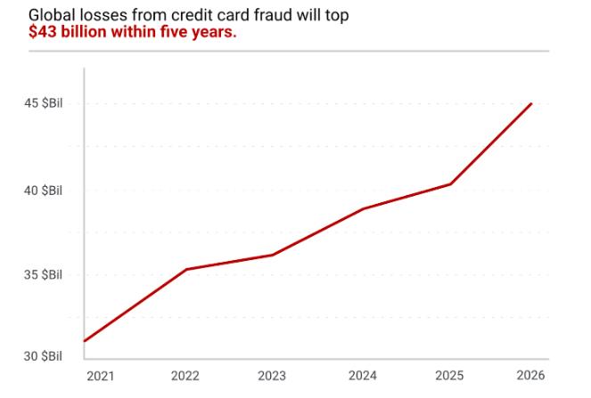

Source: [https://merchantcostconsulting.com/lower-credit-card-processing-fees/credit-card-fraud-statistics/](https://merchantcostconsulting.com/lower-credit-card-processing-fees/credit-card-fraud-statistics/)

The domain of credit card fraud detection has been an active area of research, where numerous algorithms have been applied and evaluated. Studies as far back as 2018 and 2019 have leveraged classical machine learning techniques such as Decision Trees, Support Vector Machines (SVM), Logistic Regression, Random Forest, Naive Bayes, and Multilayer Perceptrons [3][4]. These algorithms demonstrated varying degrees of success in identifying fraudulent transactions. To further address this challenge, researchers introduced smart resampling techniques like SMOTE (Synthetic Minority Oversampling Technique) and ADASYN (Adaptive Synthetic Sampling) in 2021 [5]. These techniques artificially increased the number of minority class (fraudulent transactions) samples, allowing the machine learning models to better learn from these rare but important cases. In 2022, research expanded to include generic algorithms (GA) combined with multiple machine learning models to improve detection rates and understand the correct methods of tuning hyperparameters [1]. GAs, inspired by the principles of natural selection, were employed to optimize the feature selection process, identifying the most relevant factors that contribute to fraudulent transactions. This approach improved the detection rates and provided insights into the underlying patterns of fraudulent behavior. Despite these efforts, there remains a critical challenge in minimizing false positives while achieving high accuracy in real-time fraud detection.

## References for Background

1. Ileberi, Emmanuel & Sun, Yanxia & Wang, Zenghui. (2022). A machine learning based credit card fraud detection using the GA algorithm for feature selection. Journal of Big Data. 9. 10.1186/s40537-022-00573-8.
2. Pozzolo, A.D., & Bontempi, G. (2015). Adaptive Machine Learning for Credit Card Fraud Detection.
3. Khare, N., & Sait, S. Y. (2018). Credit card fraud detection using machine learning models and collating machine learning models. International Journal of Pure and Applied Mathematics, 118(20), 825-838.
4. Varmedja, Dejan & Karanovic, Mirjana & Sladojevic, Srdjan & Arsenovic, Marko & Anderla, Andras. (2019). Credit Card Fraud Detection - Machine Learning methods. 1-5. 10.1109/INFOTEH.2019.8717766.
5. T. K. Dang, T. C. Tran, L. M. Tuan, and M. V. Tiep. (2021). Machine learning based on resampling approaches and Deep Reinforcement Learning for credit card fraud detection systems. Applied Sciences, vol. 11, no. 21, p. 10004,  doi:10.3390/app112110004

## Data Description

Dataset Link: [https://www.kaggle.com/datasets/mlg-ulb/creditcardfraud](https://www.kaggle.com/datasets/mlg-ulb/creditcardfraud)

The dataset for our study is derived from credit card transactions in September 2013 from European cardholders, featuring 284,807 transactions over two days, including 492 frauds. The data is significantly unbalanced, with frauds constituting only 0.172% of all transactions, highlighting the difficulty of identifying these events among legitimate activities. The features within this dataset are primarily numerical and are the result of a PCA transformation, aimed at preserving user confidentiality. With the exception of 'Time' and 'Amount', all other features (V1 through V28) are principal components (already undergone a dimensionality reduction method). Many new datasets include certain features such as 'Gender’, 'Age’,  'Name', etc. that are not as valuable to identify fraud as features in our selected dataset as they are seen as noise, which do not help in optimizing the model. We chose this dataset after a lot of research as it was the most detailed, comprehensive, and renowned one in spite of it being imbalanced to some extent. The 'Time' feature indicates the seconds elapsed since the first transaction, and 'Amount' represents the transaction value, which can be crucial for cost-sensitive learning models. The target variable, 'Class', is binary, indicating fraud (1) or non-fraud (0). Fraud methods and patterns evolve over time, due to many changes. It is important to note them and continuously train the model to adapt to these changes

## Problem Definition

The problem at hand is the ever-growing and increasingly sophisticated menace of credit card fraud, which has reached alarming proportions, far surpassing the capabilities of traditional detection methods currently in place. Fraudsters are continuously adapting to the security measures, making it an ongoing challenge for the financial sector to develop and deploy more advanced, real-time detection capabilities. Using simple manual methods is not enough and there is a need to introduce more automated processes. To address this growing concern, the project's problem definition encompasses a multifaceted approach leveraging state-of-the-art machine learning models and techniques to secure customers and financial institutions.

**Approach to solving this issue:**

The primary objective is to develop a robust and adaptive fraud detection system that can keep pace with the evolving strategies employed by fraudsters. This entails the utilization of a variety of supervised learning algorithms such as K-Nearest Neighbors (KNN), Random Forest classifier, Support Vector Machines (SVM), Logistic Regression, and even deep learning techniques like Neural Networks. By employing these models, the project aims to improve the accuracy and efficiency of fraud detection by analyzing historical transaction data and identifying suspicious patterns in real-time.

The project also acknowledges the challenge posed by imbalanced datasets, where the majority of transactions are legitimate, and only a small fraction represents fraudulent activity. To address this issue, it incorporates various data preprocessing and resampling methods, including undersampling, Synthetic Minority Over-sampling Technique (SMOTE), and potentially the Adaptive Synthetic Sampling (ADASYN) technique. These methods are vital in creating a more balanced dataset, ensuring that the machine learning models can effectively learn and detect fraudulent transactions without being overwhelmed by the sheer volume of legitimate ones.

Moreover, the project explores unsupervised learning algorithms such as K-Means, DBScan, and Hierarchical clustering to conduct clustering analysis. These techniques can help in uncovering hidden patterns within the data, potentially identifying groups of transactions with similar characteristics, which might be indicative of fraudulent behavior.

## Project Motivation

The rationale for tackling this issue is multifaceted, with a primary focus on safeguarding consumers and upholding the integrity of the financial system. Fraudulent transactions inflict direct financial losses on both cardholders and financial institutions, while also giving rise to longer-term consequences, including increased security costs, elevated transaction fees, and a gradual erosion of trust in electronic payment methods among customers. These repercussions underscore the imperative need for enhancing fraud detection systems.

The core technical impetus behind this project is to mitigate the impact of credit card fraud by developing a sophisticated machine learning algorithm capable of swiftly and accurately pinpointing fraudulent transactions in real-time. Our objectives revolve around minimizing the occurrence of false positives, which can be disruptive and detrimental to customer relationships, while simultaneously ensuring the effective identification of actual fraud, thereby sheltering customers' financial resources and sensitive data. In a broader context, bolstering fraud detection systems also contributes to the overall health of the financial ecosystem, sustains consumer confidence in digital transactions, and fosters a more secure environment for the burgeoning realm of e-commerce.

## Methods

### **Data Preprocessing:**

For this project, data preprocessing can be roughly split into three sections: Initial Cleaning of data, Data standardization, and finally, Data resampling.

Initial data cleaning was primarily done to ensure that there were no missing values within our dataset, and duplicate values were removed to prevent the possibility of testing data being replicated within the training data. The data cleaning process showed that there were no null values within our dataset. However, out of 284,807 observations, 1081 observations were found to be duplicates. This represented 0.38% of the dataset; 1062 were duplicate valid transactions, and 19 were duplicated fraudulent transactions. These duplicates were promptly removed, leaving us with 283,720 observations before entering the next phase of preprocessing.

Data standardization was performed after initial cleaning in order to ensure that all means across features were 0 and that all variances would be 1. The average and variance of each feature before standardization can be seen from the chart attached below (It uses a logarithmic scale, as the “Time” and “Amount” features have significantly higher average and variance than the 28 “V” variables and would completely obscure the data if such a scale was not used).

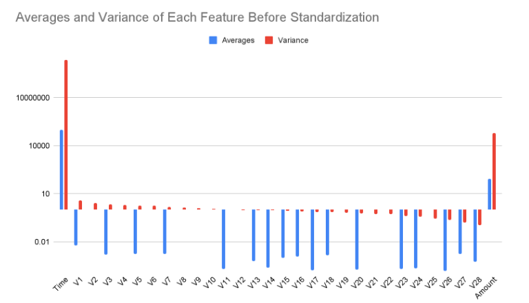

As it can be seen, whilst the means and variances for the 28 “V” features are relatively close to standardized, with most having means relatively close to 0 mean as well as variances less than 0.1, there is still clear room for improvement to most of these features. As well, the “Time” and “Amount” features clearly require standardization, with both having averages and variances significantly higher than what can be considered acceptable. As such, all values were fed into Scikit’s StandardScalar for standardization, causing all averages to become 0 and all variances to become 1.

The final step we conducted was to resample the data in order to create balanced datasets. As previously mentioned, approximately 0.172% of that actual data represents data points classified as fraud, with the remaining 99% being classified as credible transactions.

Models trained on such an imbalanced dataset would obtain over 99% accuracy by simply classifying all test observations as valid and ignoring the actual problem of detecting fraudulent transactions.

 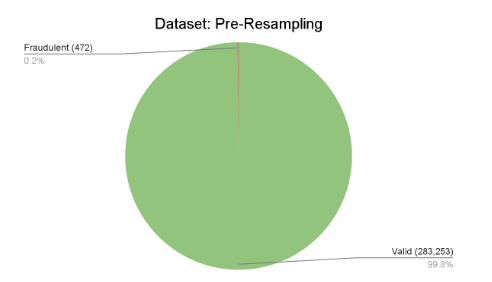

As such, we utilized multiple resampling methods to create two new, balanced datasets. For the first dataset, we utilized the method of undersampling. Specifically, as there were 472 cases of fraud, a new dataset was created by randomly selecting only 472 credible values through the use of the imbalanced-learn library's RandomUnderSampler, creating a new balanced dataset of only 944 data points.

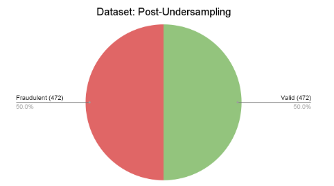

The second dataset was created using oversampling, specifically Synthetic Minority Oversampling-Technique (SMOTE). This process, also done through the imbalanced-learn library’s SMOTE class, created a new dataset by generating synthetic fraud cases to match the total number of credible cases, ultimately resulting in a dataset of 566506 data points.

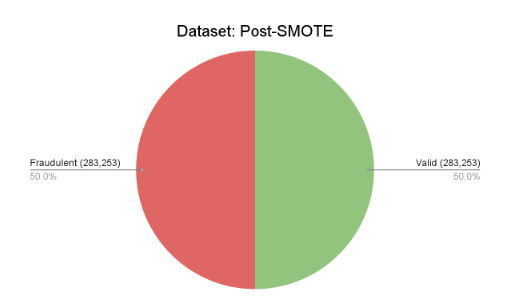

These datasets were then saved and fed into the later methods for learning and fitting.

One process we chose not to perform was dimensionality reduction. This is due to the fact that in the original dataset, the 28 “V” variables were already chosen through a round of PCA processing, with the remaining two variables, “Time” and “Amount,” being the only ones not tested through PCA. Despite these two variables, we ultimately decided that further rounds of dimensionality reduction through PCA were unnecessary, as too much information would be lost by reducing the dimensionality of the data any further. This can be seen through the following graph of the number of components kept after PCA vs the total variance remaining:

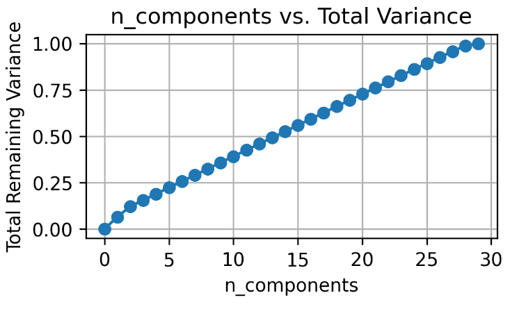

The graph demonstrates that there is a relatively linear relationship between the number of components and the total remaining variance, suggesting that it would be difficult to remove even a few components without seriously affecting the total remaining variance.

### **Support Vector Machine Model (SVM):**

SVMs or Support Vector Machines are a supervised learning technique used for classification. It works by finding a hyperplane that divides 2 classes as best as possible. To do this SVM tries to find a hyperplane such that the distances between the hyperplane and the 2 classes are maximized.

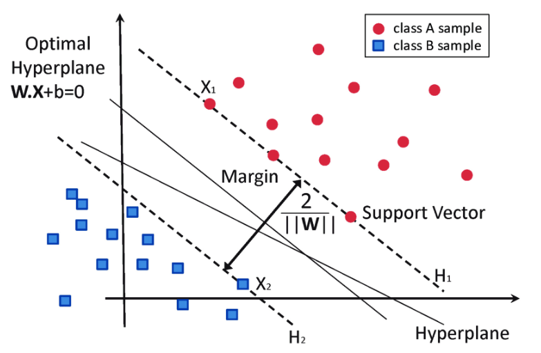

Source: [https://www.researchgate.net/publication/304611323/figure/fig8/AS:668377215406089@1536364954428/Classification-of-data-by-support-vector-machine-SVM.png](https://www.researchgate.net/publication/304611323/figure/fig8/AS:668377215406089@1536364954428/Classification-of-data-by-support-vector-machine-SVM.png)

The rationale behind SVMs is its ability to work well with many features. In the fraud detection dataset, we have around 30 features to help classify data points as fraud or not fraud. SVMs are very effective in such cases. Moreover the SVM algorithm works to maximize the margin between the classes (in this project it's a binary classification problem: either the data point is classified as fraud or not fraud), doing so reduces the chances of overfitting.

**Implementation:**

* Both the SMOTE dataset and the undersampled dataset is passed in as paths into the file. The file is structured in a way that it can accept either dataset.
* The Pandas library converts the datasets to a dataframe
* The dataset is split into Xtrain, Xtest, Ytrain and Ytest data. The split is given as 80% for the training data and 20% for test data
* From the ScikitLearn Library we then import the SVC module (Support Vector Classification). Using this SVC module, we train the SVM algorithm with the Xtrain and Ytrain dataset. Both a polynomial and a linear kernel have been implemented in this case
* We then predict fraud/non-fraud cases using the Xtest data or the remaining 20% data.

**Results and Discussion:**

After running the SVM model with the linear kernel on the undersampled dataset the following confusion matrix is produced:

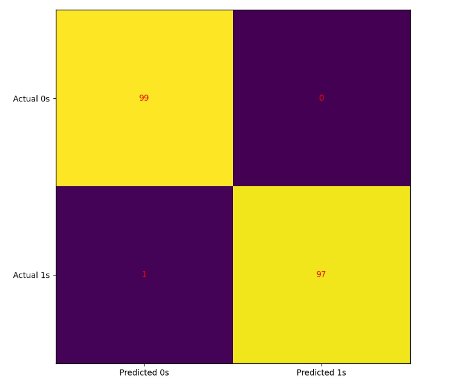

The confusion matrix shows the accuracy with which the model is able to predict fraudulent cases. With regards to the undersampled data it only incorrectly classifies 1 datapoint.

The accuracy vs number of features graph can also be seen as follows:

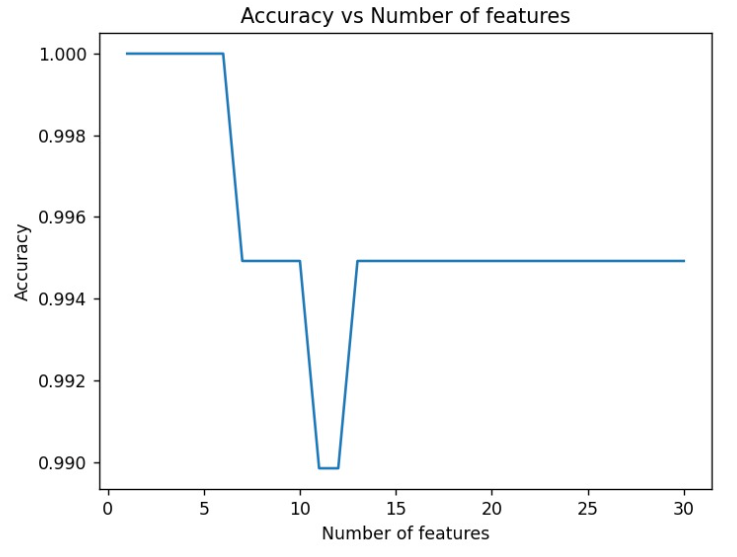

This graph shows how the accuracy varies with respect to the number of features. One thing to be noted is that no matter what the accuracy wavers very close to 1 which shows the model works with near perfect predictions with a low of 99% accuracy when tested with 11 features. Overall this graph is proof of how powerful the SVM model can be for classification.

However a near-perfect accuracy may also be cause to check for overfitting. Further analysis is needed in order to make sure to check the data is being processed correctly and/or the model is not overfitting the data.

While SVM looks to be successful at analyzing the undersampled dataset, the time complexity of the algorithm prevented it from being able to successfully analyze the SMOTE oversampled dataset using the 80-20 training and testing data split. The issues are best explained through the following text taken from the Scikit-learn documentation of SVM:

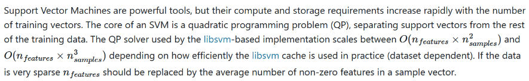

As the SMOTE oversampled dataset has a total of 566505 data points and 30 features, the time it would take to successfully run and optimize a SVM model on the dataset is far too expensive time-wise to be practical. As such, we chose not to attempt to perform a thorough analysis on the results of SVM on the SMOTE dataset, due to the time constraints of the project.

### **K-Nearest Neighbors (KNN):**

KNN operates on a simple concept: it classifies a data point based on how its neighbors are classified. The "k" in k-NN refers to the number of nearest neighbors considered when making the classification decision. The algorithm identifies the 'k' closest training examples in feature space and the class with the majority vote is the prediction for the classification task.

For instance, in a fraud detection scenario with numerous features, k-NN would look at a

data point and consider the 'k' nearest data points to it. If the majority of these 'k' points are labeled as "fraud," then the algorithm will classify the data point as "fraud", and vice versa for "not fraud." The distance between points is usually calculated using measures such as Euclidean distance, Manhattan distance, or Hamming distance, depending on the type of the data.

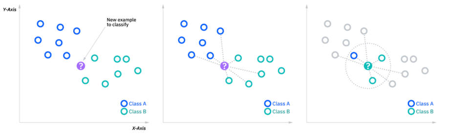

Reference: [https://www.ibm.com/topics/knn](https://www.ibm.com/topics/knn)

For our dataset, we split the data into 80% training and 20% testing, after applying Synthetic Minority Over-sampling Technique (SMOTE) and Undersampling to address class imbalance, and choose a k value of 50 to balance between noise reduction and maintaining class distinction. The rationale behind using KNN for our dataset is its effectiveness in handling multi-feature data. Our dataset, with its numerous features, is a good candidate for KNN, as the algorithm can effectively gauge similarity between data points in a multi-dimensional feature space.

**Implementation:**

We processed both the SMOTE and undersampled datasets for KNN implementation. The datasets for both undersampled and SMOTE-sampled cases were downloaded using gdown and loaded using the Pandas library. This approach ensures direct and efficient access to the datasets. The datasets were read into a Pandas DataFrame, ensuring consistency across models in data handling. The dataset was divided into features (X) and labels (y), followed by a split into training (80%) and testing (20%) sets. This split ratio aligns with our methodology in other models, maintaining consistency in evaluating model performances. We used the KNeighborsClassifier from ScikitLearn's library. The 'k' value was experimentally determined, starting from a baseline of 50, to find the optimal balance between model complexity and performance. The model was trained on the training set and predictions were made on the test set, following the standard approach in supervised learning.

**Results and Discussion:**

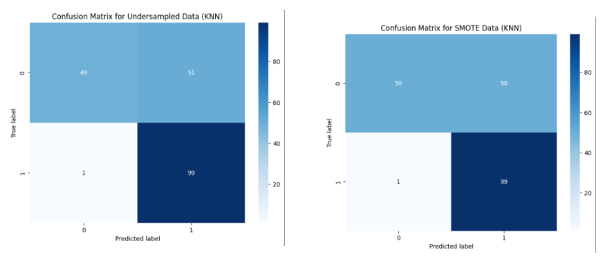

In both the undersampled and SMOTE datasets, the KNN algorithm has showcased a high degree of accuracy and reliability. The consistent performance across various metrics and cross-validation folds reflects the algorithm's potential for real-world applications in fraud detection. However, as with any model trained on specific types of datasets, it's crucial to perform further validation and testing, particularly in more complex and diverse real-world environments. This will help ensure that the model remains effective and robust when confronted with the myriad of scenarios present in actual credit card transaction data.

### **Random Forest Classifier**:

A random forest classifier is also a classification algorithm that uses many decision trees to make predictions. It is an ensemble learning algorithm that uses a collection of decision trees to make predictions, called bagging, with the idea that multiple uncorrelated models perform much better as a group than they do alone.

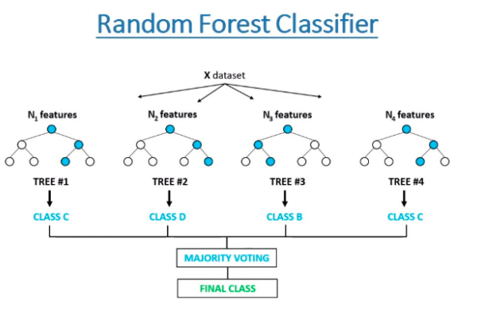

Source: [https://www.freecodecamp.org/news/how-to-use-the-tree-based-algorithm-for-machine-learning/]()

Since our dataset is extremely large, includes a many features, and has an imbalance, working with both, a SMOTE sampled dataset and an undersampled dataset, is possible for a model like Random Forest as it works with a subset of features to train each tree independent of each other. Being such a versatile binary classifier working with multiple decision trees, it is clearly a great choice for dealing with complex datasets and fraud detection tasks.

**Implementation:**

First, we import the essential libraries for this solution, which include the scikit-learn (RandomForestClassifier and metrics), matplotlib, seaborn (visualization), pandas, and numpy modules. The features (X) and labels (y) are then defined after reading the dataset, SMOTE sampled or undersampled, into a pandas DataFrame. A test size of 20% is used to divide the data into training and testing sets. A RandomForestClassifier is instantiated with a particular random state (kept the same for all runs and checked predicted values for different states), 100 estimators (default number of decision trees in the forest), and an out-of-bag score calculation (for validation and measuring correctly predicted rows from sample). After using the training data to train the model, predictions for the test data are generated. Using Seaborn's heatmap, a confusion matrix is produced. The results of computing and printing accuracy, precision, recall, F1 score, and balanced accuracy follow. Next, by looping through a list of feature numbers (difference of five between each number), the code investigates how the amount of features affects model performance. The evaluation metrics are recorded and a RandomForestClassifier is trained for every iteration. Plotting the results against the total number of features allows for the identification and printing of the most accurate model. There is a maximum amount of features that are provided for every iteration, along with 100 estimators, in the random forest parameters.

**Results and Discussion:**

Undersampled:

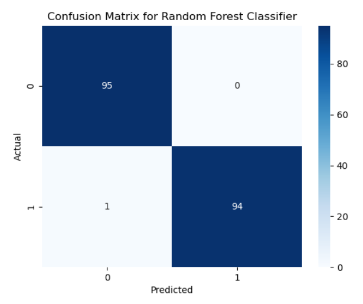

This confusion matrix that includes all features of the dataset (29) shows an extremely well trained prediction model. The Random Forest Classifier has almost perfectly classified all data points for fraud detection. There is only one data point that has been predicted incorrectly.

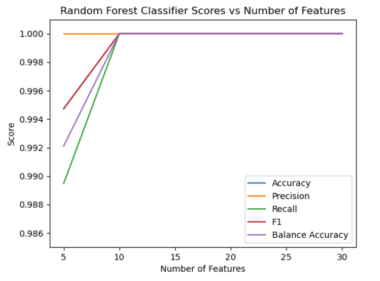

Precision was more or less the same for all numbers of features. All other quantitative metrics were slightly lower when there were only a maximum of five features. However, when there are ten or more features, there is no fluctuation in the values of all other quantitative metrics. This difference in metrics is still not very high based on the number of features, other than a slight increase in metrics from five to ten features, which was expected. Although these results are remarkable, there is more research required to ensure correct model performance based on features, no overfitting, and no data leakage.

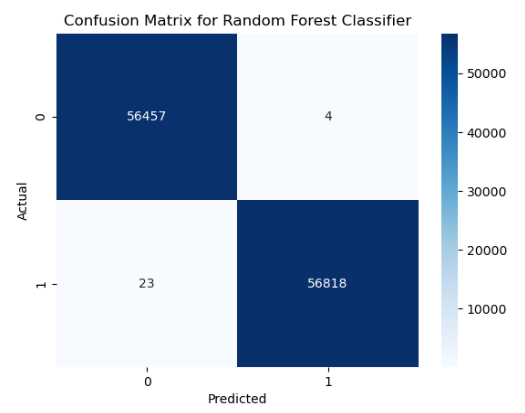

This confusion matrix that includes all features of the dataset (29) shows promising results. Even with over 100,000 test data points, the model has achieved an extremely high accuracy with only few of them being identified incorrectly as False Positive and False Negative.

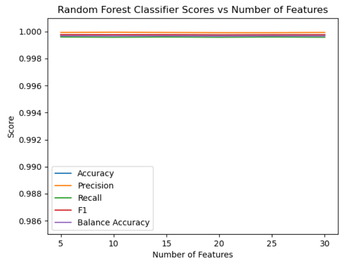
This graph depicting the values of quantitative metrics vs. number of features shows that due to a large number of datapoints in the training set, the number of features does not have a significant effect on the value of these metrics. The results are quite positive again and show that the model is performing extremely well. Some more research and data validation is required to make sure that this algorithm is not overfitting and data quality is apt.

## Analysis of Metrics and Future Work

The metrics we used to measure our model's performance were accuracy, balanced accuracy, recall, precision, and the F-1 score. In combination, these metrics give a comprehensive understanding of each model’s strengths and weaknesses. Accuracy measures the proportion of correct predictions out of the total number of predictions made by the model. It can be used to indicate whether the model is correctly identifying both positive and negative instances. Similarly, precision also serves as a measure of correctness, but only for the positive class. It is the ratio of correctly identified fraudulent transactions to the total number of instances the model identified as fraudulent. It is an indicator of how likely a model is to be correct when it identifies a fraudulent transaction. Recall measures the model's ability to correctly identify all positive instances. It's the ratio of correctly identified fraudulent transactions to all actual fraudulent transactions. High recall means that the model is effective in identifying a large proportion of the actual fraudulent transactions and minimizes the chances of missing genuinely fraudulent transactions. In many cases, there is a tradeoff between precision and recall. Thus, it is also very important to find a balance between these two metrics. This is where the F1-score becomes useful, which is the harmonic mean of precision and recall, and helps to find that balance. Lastly, balanced accuracy is the average of recall across both fraudulent and genuine transactions and measures the ability of the model to make accurate predictions for both classes.

The first model we will be looking at is KNN, which performed as follows:

| Dataset      | Accuracy | Balanced Accuracy | Recall | Precision | F1-score |
| ------------ | -------- | ----------------- | ------ | --------- | -------- |
| Undersampled | 0.9949   | 0.9949            | 0.9902 | 1         | 0.9951   |
| SMOTE        | 0.9991   | 0.9991            | 0.9983 | 1         | 0.9991   |

KNN demonstrated exceptional accuracy, precision, recall, and balanced accuracy in both the undersampled and SMOTE datasets. The consistently high values across these metrics indicate the model's strength in correctly predicting both fraudulent and genuine transactions. The KNN model identified most fraudulent transactions without flagging any genuine transaction as fraudulent. Using this model, banks can be assured of their customers' safety without being flooded by customer complaints.

However, while this model worked exceptionally well, further experimentation with different k-values and alternative distance metrics could still be beneficial.

Next, let's analyze the performance of SVM:

| Dataset      | Accuracy | Balanced Accuracy | Recall | Precision | F1-score |
| ------------ | -------- | ----------------- | ------ | --------- | -------- |
| Undersampled | 0.9974   | 0.9974            | 0.9949 | 1         | 0.9974   |

SVM, particularly with a linear kernel, showed similar levels of accuracy, recall, precision and balanced accuracy as KNN. In fact, it surpassed KNN in every metric for the undersampled dataset. SVM was incredibly effective at correctly identifying both fraudulent and genuine transactions for small datasets. However, the extensive computation time required by SVM limits its analysis capability on larger datasets, making it impractical for the datasets it would encounter if implemented in a real-world system. The time complexity of SVM prevented it from successfully running on the SMOTE dataset. Thus, going forward, exploring algorithmic or computational optimizations to improve SVM's efficiency will be crucial to its success if deployed to large real-time systems.

Finally, we will examine the performance of the Random Forest model.

| Dataset      | Accuracy | Balanced Accuracy | Recall | Precision | F1-score |
| ------------ | -------- | ----------------- | ------ | --------- | -------- |
| Undersampled | 0.9947   | 0.9921            | 0.9895 | 1         | 0.9947   |
| SMOTE        | 0.9998   | 0.9997            | 0.9996 | 0.9999    | 0.9998   |

Analysis of these metrics shows that the Random Forest model performed incredibly well in both the undersampled and SMOTE datasets. Like both of the previous models, the model exhibited a robust performance in every category indicating its ability to effectively classify both fraudulent and genuine transactions with very few errors. However,like SVM, the scalability of the model leaves something to be desired. The random forest model took over an hour to run on the SMOTE dataset which is only a fraction of the size of real-world datasets. Thus, optimization strategies such as pruning and further feature reduction can be considered going forward.

Notably, the measured performance metrics for each of the models were incredibly high, we even observed better performance than several published studies that used the same dataset. To investigate this, we performed several data validation techniques such as 5-fold cross-validation, and further analyzed the composition of the dataset for duplicate values or any other inconsistencies that could possibly lead to this anomaly. Furthermore, the team met with a teaching assistant to find the root cause of the improved performance. However, even then, we were unable to pinpoint the reason behind it. Going forward, this is a major concern for ensuring the validity of the study, and further research/testing will be conducted. Another concern is the time complexity of our models. This is a very important factor when considering the potential real-world datasets the models may face. Going forward, we will attempt to further optimize our models and determine the scalability of each model by testing it on SMOTE datasets of varying sizes. After working on validating and improving the data to ensure that the algorithms operate in a more realistic manner, few other goals involve dealing with hyperparameter tuning and trying to identify certain features that may be hindering the performance of these supervised learning models. We will also be dealing with unsupervised learning algorithms in the future that help predict fraud transactions from the dataset. This will assist us in finding the right approach for this problem and if any integration of models is required.

## Contribution Table

| Name              | Contribution                                                                                               |
| ----------------- | ---------------------------------------------------------------------------------------------------------- |
| Saarang Prabhuram | SVM Model Coding, Report (SVM Model, Analysis and Metrics), Github Page                                    |
| Rohan Batra       | Random Forest Model Coding, Report (Introduction, Problem Definition, Random Forest, Analysis and Metrics) |
| Maniya Dahiya     | KNN Model Coding, Report (Introduction, Problem Definition, KNN, Analysis and Metrics)                     |
| Richard Zhao      | Data Preprocessing, Report (Data Preprocessing, Project Motivation, Analysis and Metrics), Gantt Chart     |
| Shane Sinnerine   | Data Preprocessing, Report (Data Preprocessing, SVM Model, Analysis and Metrics)                           |

[Go back](./)
