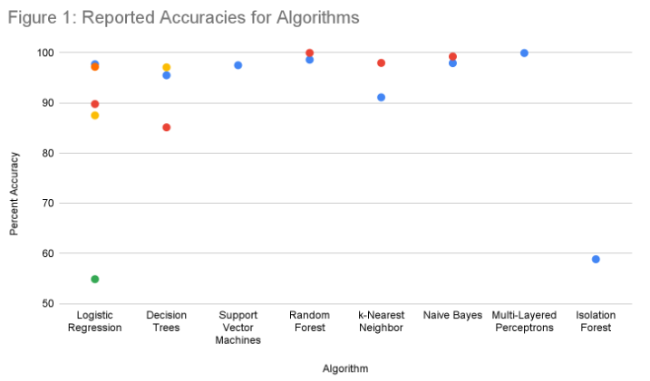

## Introduction

Around 151 million American adults experienced credit card fraud in 2023, a considerable rise from the 58% victim rate in 2022. The rise of electronic payment methods like tap-to-pay and online billing has eliminated the need for traditional identification protections like signatures. Significant issues associated with credit card fraud include financial losses, identity theft, a decline in faith in electronic payment systems, and a drain on institutional resources. In order to protect customers and financial institutions, our research intends to create an algorithm that can identify fraudulent transactions in real-time.

## Background (Literature Review)

In previous years, researchers utilized various algorithms like "Decision Tree," "SVM," and "Logistic Regression" in 2018, and "Random Forest," "Naive Bayes," and "Multilayer Perceptron" in 2019 to analyze data and develop classifiers for performance comparison [3][4]. Research performed in 2022 also involved the use of generic algorithms along with multiple ML models like the ones mentioned above to work on this problem [5]. We aim to minimize false positives and explore smarter, possibly real-time solutions for this growing issue.

## Dataset and Methods

Dataset: [https://www.kaggle.com/datasets/mlg-ulb/creditcardfraud](https://www.kaggle.com/datasets/mlg-ulb/creditcardfraud)

We have a credit card transaction dataset from September 2013 with hidden features (PCA components). Our goal is to preprocess the data for both unsupervised and supervised learning to analyze and classify it. We plan to apply unsupervised methods like K-means, DBScan, and Hierarchical clustering for clustering analysis. Additionally, we'll use supervised learning techniques like Linear Regression, Support Vector Machines with linear models, Random Forest, Decision Trees, and Neural Networks for classification. To address data imbalance and feature scale variations, we'll employ techniques such as undersampling/oversampling and normalization to ensure a balanced and uniform dataset. We'll begin by classifying the preprocessed dataset using supervised algorithms, splitting it into features (X) and labels (Y). After training a portion of the dataset with the supervised algorithm, we'll drop the labels for unsupervised learning. The features will then be used with the initial classifiers for anomaly detection through clustering techniques.

## Potential Results and Discussion

Based on prior research and similar fraud detection efforts, we can estimate the potential outcomes of our algorithms. This data can be observed from the graph in Figure 1:

The data shows that, with proper training and data preprocessing to balance datasets, we can typically achieve at least 90% accuracy with various algorithms, although final accuracies can vary widely. Only 492 out of the 284,807 data points included in the research for these algorithms - or 0.172% of the total - were fraud incidents [2]. During training, we employed complex methods such as oversampling and undersampling to ensure valid results. The effectiveness of our fraud classifier hinges on addressing data imbalances in our datasets, as relying on skewed data can lead to false negatives in fraud scenarios despite achieving high accuracy. We must evaluate additional metrics in addition to accuracy, such as recall, precision, F1 score, confusion matrix, and balanced accuracy. This semester, given the growing fraud trends, it is essential to address class imbalance, ensure model interpretability, and conduct routine updates. Success will depend heavily on adaptive learning and real-time feedback.

## Contribution Table

| Contributor       | Tasks                                                                               |
| ----------------- | ----------------------------------------------------------------------------------- |
| Saarang Prabhuram | Github Pages, Introduction, Problem Definition, Proposed Timeline / Gantt Chart     |
| Rohan Batra       | Background, Introduction, Potential Datasets, Problem Definition, Proposed Timeline |
| Richard Zhao      | Potential Datasets, Methods, Potential Results, Discussion                          |
| Shane Sinnerine   | Methods, Contribution Table, Presentation                                           |
| Maniya Dahiya     | Methods, Discussion, Video, Presentation                                            |

## Potential References

1. Ileberi, Emmanuel & Sun, Yanxia & Wang, Zenghui. (2022). A machine learning based credit card fraud detection using the GA algorithm for feature selection. Journal of Big Data. 9. 10.1186/s40537-022-00573-8.
2. Pozzolo, A.D., & Bontempi, G. (2015). Adaptive Machine Learning for Credit Card Fraud Detection.
3. Khare, N., & Sait, S. Y. (2018). Credit card fraud detection using machine learning models and collating machine learning models. International Journal of Pure and Applied Mathematics, 118(20), 825-838.
4. Varmedja, Dejan & Karanovic, Mirjana & Sladojevic, Srdjan & Arsenovic, Marko & Anderla, Andras. (2019). Credit Card Fraud Detection - Machine Learning methods. 1-5. 10.1109/INFOTEH.2019.8717766.
5. leberi, E., Sun, Y. & Wang, Z. A machine learning based credit card fraud detection using the GA algorithm for feature selection. J Big Data9, 24 (2022). https://doi.org/10.1186/s40537-022-00573-8I
6. “Credit-Card-Fraud-Detection”. Dec 7 2021 [Online]. Available: [https://russell-newton.github.io/Credit-Card-Fraud-Detection/final](https://russell-newton.github.io/Credit-Card-Fraud-Detection/final)**

[Go back](./)
